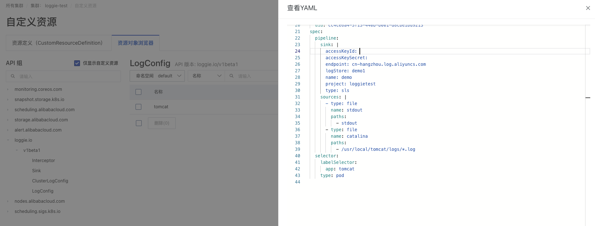

# Using Alibaba Cloud Observable Unified Storage SLS

Regardless of whether your service is deployed on Alibaba Cloud or using a hybrid cloud architecture, Loggie supports collecting log data and send it to Alibaba Cloud [SLS](https://www.aliyun.com/product/sls).
And you just need to use `sls sink`.

> For the use of Loggie in Alibaba Cloud's official documentation, please refer to: [upload logs with Loggie](https://help.aliyun.com/document_detail/434306.htm).


## Preparation: Create SLS Project

In order to use Alibaba Cloud Observable Unified Storage SLS, we need to create a corresponding Project first. As shown below, on SLS page, click `Create Project`, fill in the project name and the corresponding region, and create the corresponding Logstore.


Then we can prepare `sls sink` configuration. The example is as follows. Please refer to [sls sink configuration](../../reference/pipelines/sink/sls.md) for details:

!!! example "sls sink"

    ```yaml
        sink:
          type: sls
          name: demo
          endpoint: cn-hangzhou.log.aliyuncs.com
          accessKeyId: xxxx
          accessKeySecret: xxxx
          project: test
          logstore: test1
          topic: myservice
    ```

## Collect logs on ECS

Refer to [Deploy on hosts](../../getting-started/install/node.md). We can modify the pipeline.yml and add the configuration of the sls sink.

The pipeline configurationexample is as follows:

!!! example "sls pipeline"

    ```yaml
    pipelines:
      - name: test
        sources:
          - type: file
            name: demo
            addonMeta: true
            paths:
              - /tmp/log/*.log
        sink:
          type: sls
          endpoint: cn-hangzhou.log.aliyuncs.com
          accessKeyId: ${accessKeyId}
          accessKeySecret: ${accessKeySecret}
          project: loggietest
          logstore: demo1
          topic: myservice
    ```

## Collect Logs of ACK Kubernetes Cluster

Like the self-built Kubernetes cluster, Loggie can also be deployed i Alibaba Cloud ACK. We can use kubectl or helm to deploy according to the kubeconfig file provided by ACK. Refer to [Deploy in Kubernetes](../../getting-started/install/kubernetes.md).

Node:

- If you want to collect Pod logs that are not mounted with emptyDir/hostPath, make sure that the system configuration in values.yaml `discovery.kubernetes.rootFsCollectionEnabled` set true.
- Configure `discovery.kubernetes.containerRuntime` to match the Kubernetes cluster. The default is containerd.

After deployment, similar to the usage under the conventional Kubernetes cluster, ClusterLogConfig/LogConfig/Interceptor/Sink CR can also be used.


ACK provides a CRD usage page, we can create and modify it directly in this page.


For an example of collecting logs of a service, just use `sls sink`. You can also create a sink CR storage `sls sink` configuration separately and refer to it through sinkRef in LogConfig.

!!! example "logconfig"

    ```yaml
    apiVersion: loggie.io/v1beta1
    kind: LogConfig
    metadata:
      name: tomcat
      namespace: default
    spec:
      selector:
        labelSelector:
          app: tomcat
        type: pod
    
      pipeline:
        sources: |
          - type: file
            name: stdout
            paths:
              - stdout
          - type: file
            name: access
            ignoreOlder: 3d
            paths:
              - /usr/local/tomcat/logs/*.log
    
        sink: |
          type: sls
          endpoint: cn-hangzhou.log.aliyuncs.com
          accessKeyId: ${accessKeyId}
          accessKeySecret: ${accessKeySecret} 
          project: loggietest
          logstore: demo1
          topic: myservice
    ```

## View logs

We can view the collected logs in the specific Project of SLS, as shown in the following figure:


For details on adding meta information and modifying log fields, refer to [Log Segmentation](../best-practice/log-process.md) and [Add Meta Info](../best-practice/log-enrich.md)。

