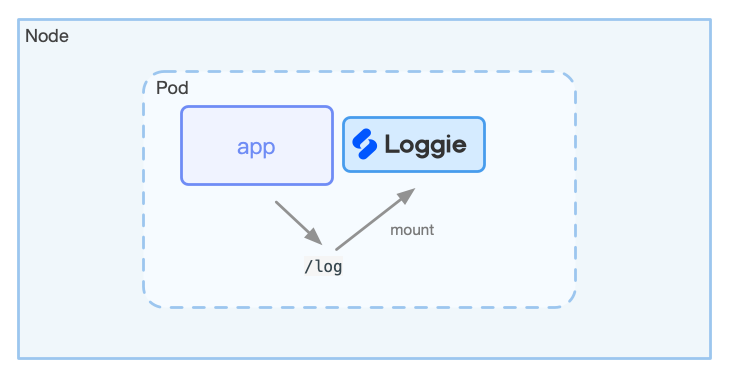

# Logs Collected in Sidecar Method

> Although it is not recommended to use the sidecar method to collect container logs by default, in some limited scenarios, only the sidecar method can be used to collect container logs. Here we give an example for reference.  

## General Idea

As shown below:

 
Loggie and the business container are deployed in the same Pod, and the same log file volume needs to be mounted. In addition, the configuration of Loggie can be mounted to the container through configMap. Loggie collects the logs of the container according to the provided configuration file in configMap, and send them to the backend.

## Injecte Loggie Sidecar

```yaml
apiVersion: apps/v1
kind: Deployment
metadata:
  labels:
    app: tomcat
  name: tomcat
  namespace: default
spec:
  replicas: 1
  selector:
    matchLabels:
      app: tomcat
  template:
    metadata:
      labels:
        app: tomcat
    spec:
      containers:
      - name: tomcat
        image: tomcat
        volumeMounts:
        - mountPath: /usr/local/tomcat/logs
          name: log

      - name: loggie
        args:
        - -config.system=/opt/loggie/loggie.yml
        - -config.pipeline=/opt/loggie/pipeline.yml
        image: loggieio/loggie:main
        volumeMounts:
        # same log volume
        - mountPath: /usr/local/tomcat/logs
          name: log
        # loggie configuration configMap
        - mountPath: /opt/loggie
          name: loggie-config
        # loggie data
        - mountPath: /data
          name: registry

      volumes:
      - emptyDir: {}
        name: log
      - emptyDir: {}
        name: registry
      - name: loggie-config
        configMap:
          name: tomcat-loggie-config

---
apiVersion: v1
kind: ConfigMap
metadata:
  name: tomcat-loggie-config
  namespace: default
data:
  loggie.yml: |
    loggie:
      reload:
        enabled: true
        period: 10s
      monitor:
        logger:
          period: 30s
          enabled: true
        listeners:
          filesource: ~
          filewatcher: ~
          reload: ~
          sink: ~
      http:
        enabled: true
        port: 9196
  pipeline.yml: |
    pipelines:
    - name: "tomcat"
      sources:
        - type: "file"
          name: "tomcatlog"
          paths:
            - "/usr/local/tomcat/logs/*.log"
          fields:
            namespace: default
            deployment: tomcat
          fieldsFromEnv:
            podname: HOSTNAME
      sink:
        type: "dev"
        printEvents: true
        codec:
          pretty: true
        
```

You can use the loggie sidecar to collect container logs by referring to the above exapmle.
Node:

- At present, it is not recommended to enable kubernetes discovery in the configuration file. Since Kubernetes will be requested after opening, when there are many Pods, it will cause certain pressure on Kubernetes. Therefore, LogConfig CRD cannot be used, and configMap needs to be used to mount the configuration file. 
- Since Kubernetes discovery is not used, the fields here will not be automatically added with the Pod's meta information, and need to be obtained from the Pod's environment variables using the fieldsFromEnv.
  
!!! tips
    - Fixed information such as namespace can be configured in fields, or referenced to env by using the downward API.
    - The Env environment variable obtained by fieldsFromEnv is not limited to the env field configured in the Pod yaml, but any environment variable in the Loggie container. We can execute the `env` command in the container to view it. 
  
- Modifying the parameters in the configMap will take a period of time to be refreshed to the Pod. If you want it to take effect immediately, you need to rebuild the Pod. Please pay attention to whether it will affect the business.

!!! info 
    In the future, Loggie will support automatic Sidecar injection and automatic generation of ConfigMap mounts through LogConfig, so as to achieve the same experience as using DaemonSet.
